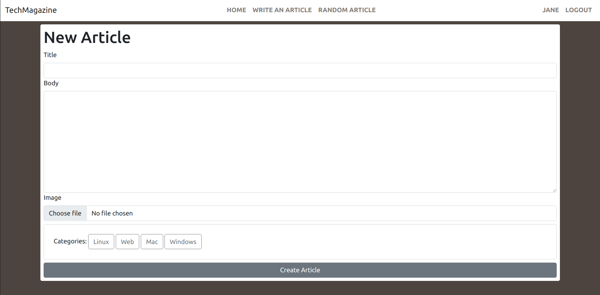

# TechMagazine

> This is a online magazine, where anyone can sign in and create articles. Each article has to be assigned to at least category. By default the magazine has four categories - Web, Mac, Linux and Windows.

> You can also visit a random article by clicking the Random Article link





### Prerequisites

- Ruby: 2.7.2
- Rails: 6.1.1
- Postgres: >=9.5

## Live Demo

[Link](https://web-tech-mag.herokuapp.com/)


## Getting Started

To get a local copy up and running follow these simple example steps.
1. Open Terminal.
2. Navigate to your desired location to download the contents of this repository.
3. Clone this repository
4. Navigate to root diretory ```cd web-magazine```.

### Setup

Instal gems with:

```
bundle install
```

Setup database with:

```
   rails db:create
   rails db:migrate
```


## Use

- Navigate to the root directory of the project
- Run `rails server`
- Open a browser and visit `127.0.0.1:3000`
- Sign in and write articles!

## Testing

- Run Rspec 'rspec -f -d'


## Authors

👤 **Alaukik**

- Github: [@newhorizon-tech](https://github.com/newhorizon-tech)
- Twitter: [@techintosh3](https://twitter.com/techintosh3)


## 🤝 Contributing

Contributions, issues and feature requests are welcome!

Feel free to check the [issues page](https://github.com/newhorizon-tech/web-magazine/issues/).

## Show your support

Give a ⭐️ if you like this project!

## Acknowledgments

Design idea by [Nelson Sakwa on Behance](https://www.behance.net/gallery/14554909/liFEsTlye-Mobile-version)

- The Rails Guides

## 📝 License

MIT License
